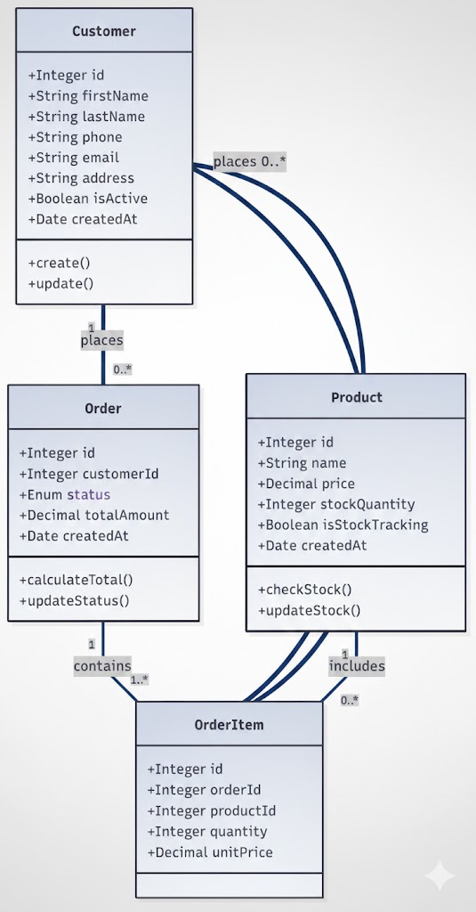
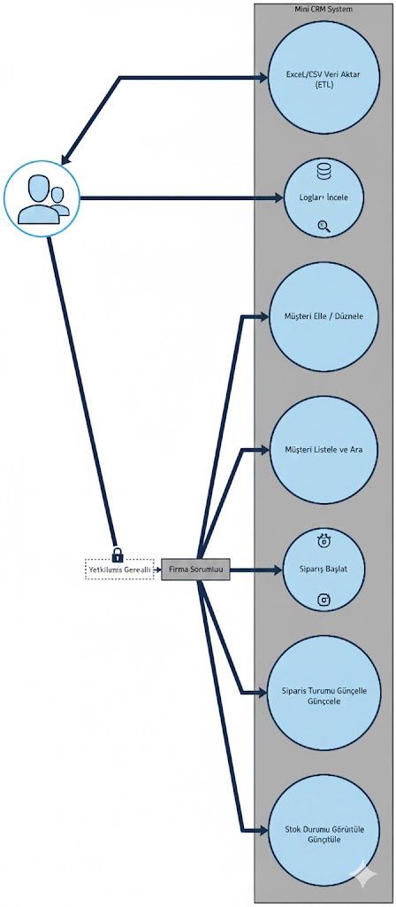

# 📋 Gereksinim Analizi ve Sistem Tasarım Spesifikasyonu

Bu doküman, Mini CRM projesinin geliştirilme sürecinde temel alınan kullanıcı ihtiyaçlarını, iş kurallarını ve teknik çözüm mimarisini detaylandırmaktadır.

---

## 1. Stratejik Analiz: İş Sorguları

Proje başlangıcında veri tutarlılığını sağlamak adına aşağıdaki kritik sorulara yanıt aranmıştır:

### 👤 Müşteri İlişkileri Yönetimi
* **Eksik Kimlik Bilgileri:** Soyadı bilgisi bulunmayan müşteriler için sistem kısıtlayıcı olmalı mı? 
  * *Karar:* Veritabanı seviyesinde `nullable` izin verilerek esneklik sağlandı.
* **İletişim Standardizasyonu:** Mükerrer kayıtların tespiti için hangi kriter baz alınmalı?
  * *Karar:* E-posta ve Telefon Numarası birincil tekilleştirme anahtarı olarak belirlendi.

### 📦 Ürün ve Envanter Kontrolü
* **Esnek Stok Yönetimi:** Stok takibi zorunlu olmayan (hizmet tipi) ürünler sistemde nasıl temsil edilmeli?
  * *Karar:* `is_stock_tracking` bayrağı ile dinamik stok kontrol mekanizması kuruldu.
* **Fiyatlandırma Esnekliği:** Ürün kartlarında birden fazla maliyet tipi (Sabit/Değişken) desteklenmeli mi?

### 🛒 Sipariş Operasyonları
* **Hızlı Satış Senaryosu:** Mevcut olmayan müşteriler için süreç nasıl işlemeli?
  * *Karar:* Sipariş anında minimum veriyle (Ad-Tel) "Hızlı Kayıt" özelliği tasarlandı.
* **Süreç Durumları:** Sipariş yaşam döngüsü hangi statülerden oluşmalı?

---

## 2. Fonksiyonel Kapsam Dokümanı

Sistem, aşağıdaki ana modüller üzerinden operasyonel faaliyetlerini yürütür:

### A. Müşteri Bilgi Sistemi
* Temel kimlik bilgileri (Ad, Soyad, Tel, E-posta, Adres) ilişkisel şemada saklanır.
* **Benzersizlik Kuralı:** Telefon numarası üzerinden otomatik mükerrer kontrolü yapılır.
* **Veri Güvenliği:** Silinen kayıtlar veritabanından tamamen yok edilmez, "Soft Delete" yöntemiyle arşivlenir.

### B. Katalog ve Stok Modülü
* Ürünler için hassas fiyatlandırma (`Decimal`) ve miktar takibi yapılır.
* Stok takibi pasif olan ürünlerde miktar kontrolü devre dışı bırakılarak sürekli satış imkanı sunulur.

### C. İşlem ve Sipariş Yönetimi
* Tüm siparişlerin bir müşteri kimliği ile doğrulanması esastır.
* **Statü Yönetimi:** Siparişler `PENDING` (Beklemede) ile başlar ve `COMPLETED` (Tamamlandı) aşamasına kadar izlenir.

---

## 3. Teknik Mimari ve Şemalar

Proje tasarımı, sistemin görsel ve mantıksal modellemesini içeren diyagramlarla desteklenmiştir.

### 📐 Nesne İlişki Modeli (Class Diagram)
Sistemdeki sınıfların birbirleriyle olan bağlantılarını ve veri yapılarını gösterir.

### 🎭 Kullanıcı Etkileşim Modeli (Use Case Diagram)
Farklı kullanıcı rollerinin (Yönetici, Personel) sistem üzerindeki yetki sınırlarını tanımlar.

---

## 🛠️ Teknoloji Yığın Seçimi (Tech Stack)

* **Çekirdek Yapı:** Node.js tabanlı Express.js framework'ü.
* **Veri Katmanı:** PostgreSQL veritabanı ve Sequelize ORM kütüphanesi.
* **İzlenebilirlik:** Winston Logger ile uçtan uca Trace ID destekli günlükleme.
* **Güvence:** Jest framework'ü ile %100 kapsama hedefli otomatize testler.