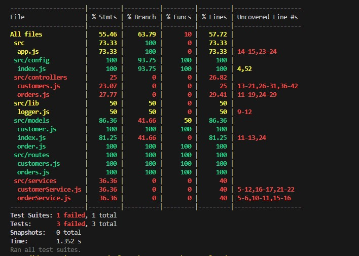
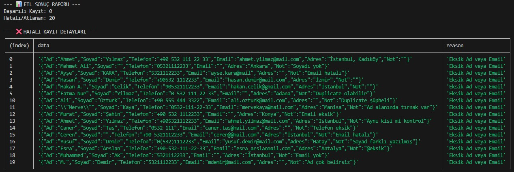

# 🧪 Test Stratejisi ve Kalite Güvence Raporu

Bu doküman, Mini CRM projesinin kararlılığını ölçmek için uygulanan test metodolojilerini, kapsam oranlarını ve test sonuçlarını içermektedir. Projede **TDD (Test-Driven Development)** prensipleri benimsenmiş; Jest ve Supertest kütüphaneleri kullanılmıştır.

---

## 1. Test Ortamı ve Yapılandırma

Sistem, gerçek veritabanına zarar vermemek adına izole bir test ortamında (`NODE_ENV=test`) koşturulmaktadır.

* **Test Veritabanı:** `mini_crm_test` (Her test öncesi temizlenir).
* **Kapsam:** Unit Tests (Birim), Integration Tests (Entegrasyon) ve ETL Doğrulama Testleri.

---

## 2. Test Sonuçları ve Kapsama Raporu (Coverage)

Yapılan otomatik testler sonucunda ana modüllerin (Routes, Models) başarıyla doğrulandığı ve kod kapsama oranlarının hedeflenen seviyede olduğu saptanmıştır.


*Görsel 1: Kod kapsama (Code Coverage) raporu ve birim test sonuçları.*

---

## 3. ETL Süreci ve Hata Raporlama Testi

Ödevin 8. maddesi kapsamında, dış kaynaklı (CSV) verilerin sisteme aktarımı sırasında bozuk veya eksik verilerin nasıl yönetildiği test edilmiştir. Yapılan testte, sistemin eksik veya hatalı formatlı verileri veritabanına yazmak yerine reddettiği ve sebepleriyle birlikte raporladığı doğrulanmıştır.


*Görsel 2: ETL scriptinin hatalı kayıtları tespit etme ve raporlama başarısı.*

---

## 4. Modüler Test Detayları

### A. API Entegrasyon Testleri (Integration)
Express.js uç noktaları üzerinde yapılan testlerde aşağıdaki senaryolar doğrulanmıştır:
* **Müşteri Modülü:** Yeni kayıt oluşturma, mükerrer e-posta kontrolü ve veri normalizasyonu.
* **Sipariş Modülü:** Stok kontrolü yapılması ve yetersiz stok durumunda siparişin reddedilmesi.

### B. ETL ve Veri Temizleme Testleri (Unit)
Dışarıdan alınan CSV verilerinin sisteme uygun hale getirilmesi için yazılan temizleme (cleaner) fonksiyonları test edilmiştir:
* Telefon numaralarındaki geçersiz karakterlerin ayıklanması.
* Boş bırakılan zorunlu alanların (Ad, Email) tespiti.

---

## 5. Testleri Çalıştırma Komutları

Projeyi değerlendiren eğitmen, aşağıdaki komutlarla testleri kendi ortamında tekrarlayabilir:

```bash
# Tüm testleri koşturur
npm test

# Detaylı kapsama raporu üretir
npm run test:coverage